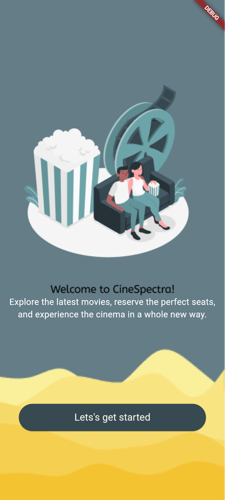
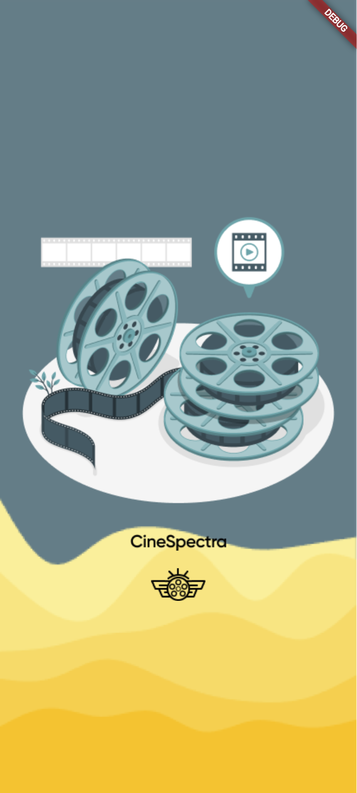
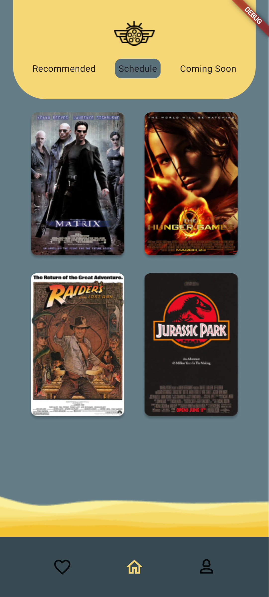
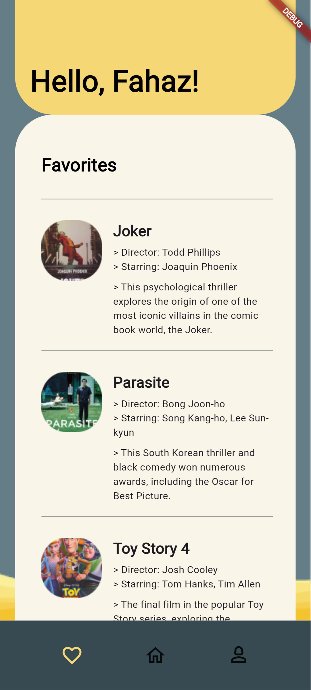

# 🎬 CineSpectra: Premium Movie Discovery UI
<p align=center>

</p>

**CineSpectra** is a high-fidelity, responsive movie exploration application built with **Flutter**. This project serves as the **Final Capstone Project** for the Mobile App Development course at **Bano Qabil 2.0**. 

The primary goal of this project was to translate a complex, professional Figma design into a pixel-perfect mobile experience that works seamlessly across all devices, from small-screen phones (iPhone SE) to large-screen tablets (iPad Pro).

---

## 🔗 Project Links
- **Figma Design:** [CineSpectra Community Design](https://www.figma.com/file/Gppq4AMM40C8LVzmD3mK0g/CineSpectra-(Community)?type=design&node-id=0%3A1&mode=design&t=3gga4701DwXFIehQ-1)
- **Live Web Demo:** [View Live on GitHub Pages](https://shadowrulin.github.io/CineSpectra-Flutter-Movie-UI/)

---

## 📱 Visual Showcase

| Splash & Login | Home & Movie Grid | Profile & Favorites |
| :---: | :---: | :---: |
|  |  |  |

---

## ✨ Key Features
- **Adaptive Layouts:** Fully responsive UI implemented using `MediaQuery`, `BoxConstraints`, and `FittedBox` to ensure zero overflow errors across different aspect ratios.
- **Figma-to-Code:** Precise translation of typography, color palettes, and component spacing from the original CineSpectra design.
- **Dynamic Navigation:** Smooth transitions between Splash, Onboarding, Authentication, and the Dashboard.
- **Custom UI Components:** Reusable widgets for Movie Cards, Profile Options, and Navigation Bars.

---

## 🛠️ Technical Implementation
- **State Management:** Using `StatefulWidget` for real-time UI updates and checkbox logic.
- **Responsiveness Strategy:** - Used `screenHeight * percentage` for flexible container scaling.
    - Implemented `Expanded` and `Flexible` for text-wrapping in movie descriptions.
    - Utilized `SingleChildScrollView` to prevent rendering crashes on smaller devices.
- **Asset Handling:** Optimization of high-resolution movie posters and vector logos.

---

## 📁 Project Structure
- `lib/screens/`: Logic and layouts for Splash, Login, Create Account, and Home.
- `lib/widgets/`: Modular components (e.g., `tile` widget) for cleaner, maintainable code.
- `assets/`: Structured folders for backgrounds, movie posters, and branding.

---

## 🚀 How to Run Locally
1. **Clone the repository:**
   
   ```bash
     git clone https://github.com/SHADOWRULIN/CineSpectra-Flutter-Movie-UI.git

2. **Install dependencies:**
   
   ```bash
     flutter pub get

3. **Launch the application:**
   
   ```bash
     flutter run

---

## 👤 Author

**Muhammad Fahaz Khan**

<i>Building responsive digital experiences.</i>

- **GitHub:** [@SHADOWRULIN](https://github.com/SHADOWRULIN)

- **LinkedIn:** [Fahaz Khan](https://www.linkedin.com/in/muhammad-fahaz-khan-85b805293/)

---

## 📄 License
This project is licensed under the **MIT License**.
